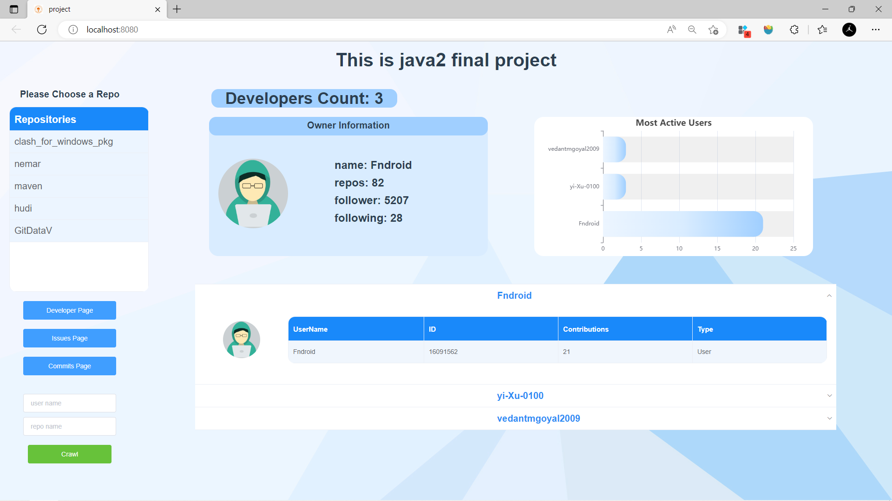
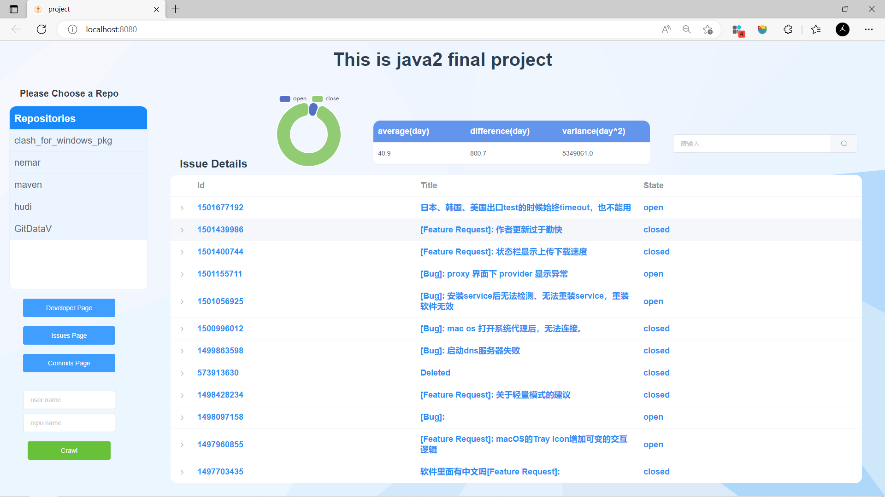
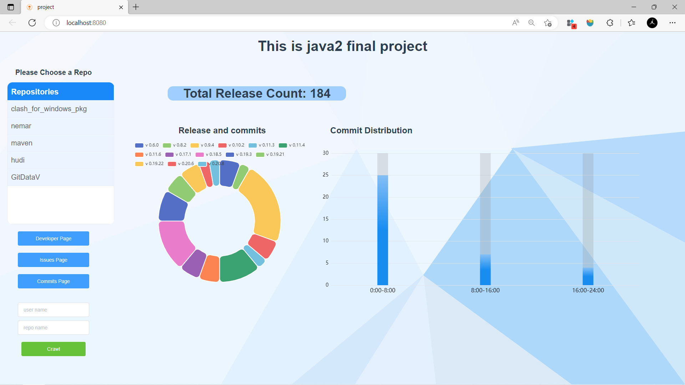
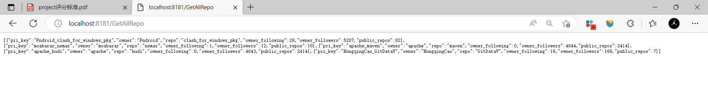
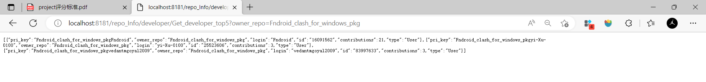
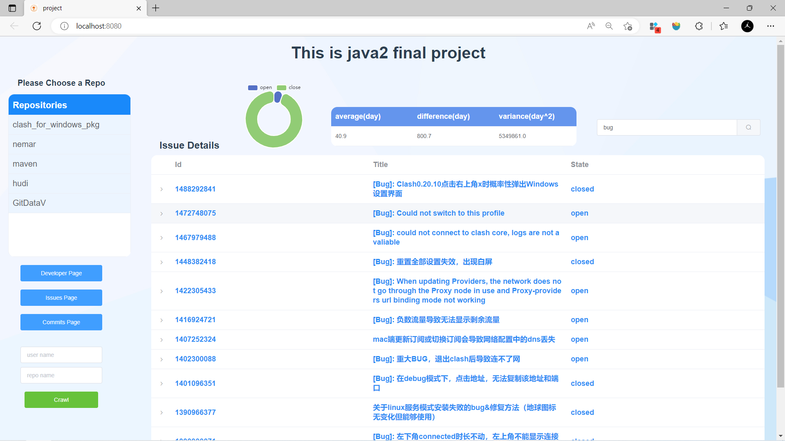

# Java2 Final Project Report

|          |                            |                              |
| -------- | -------------------------- | ---------------------------- |
| 贡献占比 |                            |                              |
| 分工     | 前端页面设计以及数据可视化 | 后端数据爬取以及提供数据接口 |
| 技术框架 | Vue，Element ui，Echarts   | Spring boot，postgres        |

### Basic Requirements 

#### Developers



#### Issues



#### Releases & Commits



### Advanced Requirements

#### Multiple repositories

#### REST services






#### Issue topics




####  Data Collection & Storage 

```java
<dependency>
            <groupId>com.google.code.gson</groupId>
            <artifactId>gson</artifactId>
            <version>2.8.9</version>
</dependency>
<dependency>
            <groupId>cn.hutool</groupId>
            <artifactId>hutool-all</artifactId>
            <version>5.1.4</version>
</dependency>
// HttpRequset
    HttpRequest httpRequest = HttpUtil.createGet(Data_Crawl_URL).header("Authorization", token)
// Handle Json String
    JsonParser parser = new JsonParser();
    JsonElement element = parser.parse(json_String_Content);
    JsonArray jsonArray = element.getAsJsonArray();
    
```

Google gson is used to process the json format, and hutool.Https is used to set the request header.

#### Practicability

We finally used intranet penetration to achieve public access to the web page, which can be used as an auxiliary tool of github for users to view relevant data and information of repo.
